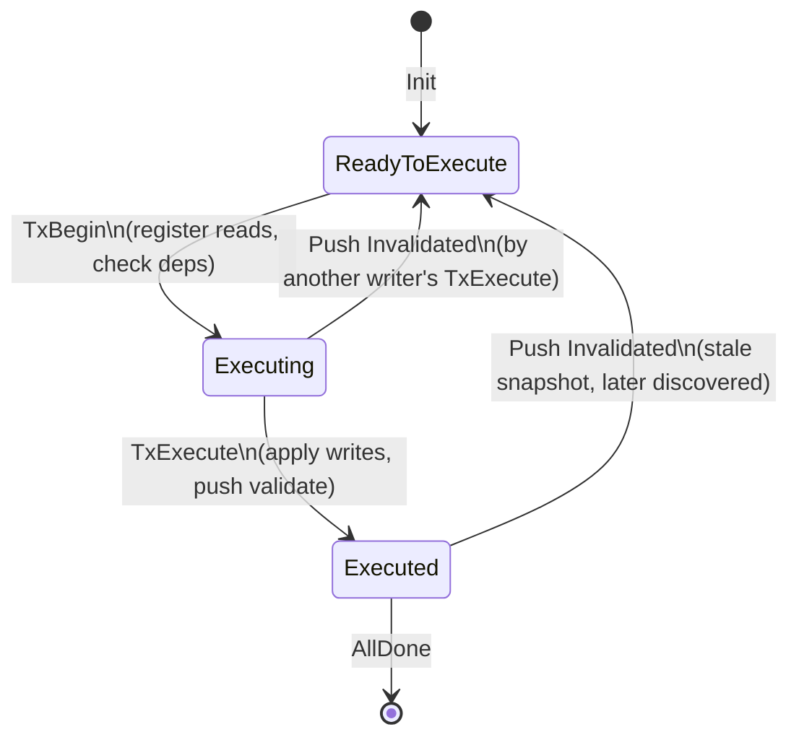
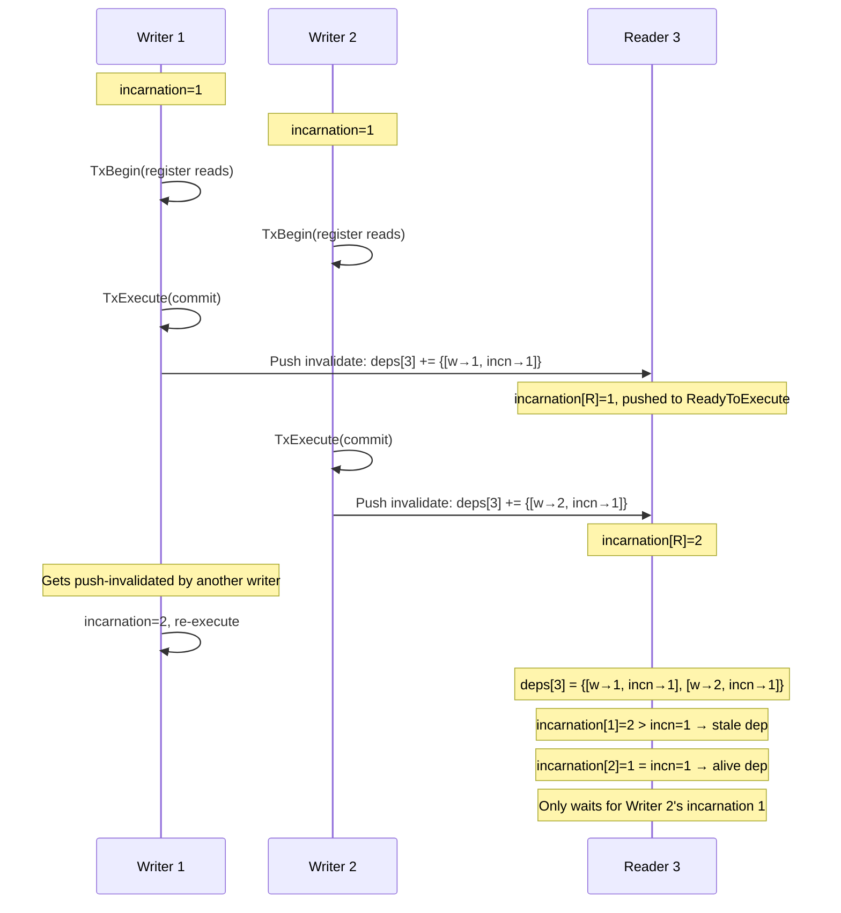

# Execution Scheduler on Push Validation — Design Report

## 1. Overview

This document describes the design of an **execution scheduler** built on top of the push validation model formalized in `Dependency.tla`. The scheduler extends the core push-validation protocol with a multi-executor scheduling discipline that:

1. **Prioritizes low-index transactions**, matching the scheduling policy of all Block-STM variants.
2. **Exploits read/write dependency information** from push validation — a transaction is only scheduled when its direct *and indirect* dependencies have all completed execution.
3. **Respects incarnations** — a dependency pins a *specific incarnation* of a writer; if the writer has advanced past that incarnation (re-executed), the dependency may be stale and can be safely ignored.

The architecture follows a two-layer design:	

```
┌─────────────────────────────────────┐
│        DepScheduler.tla             │  ← Scheduling layer
│  (multi-executor, priority queue,   │
│   transitive dep checking)          │
├─────────────────────────────────────┤
│        Dependency.tla               │  ← Core protocol layer
│  (push validation, rels tracking,   │
│   incarnation-aware deps)           │
├─────────────────────────────────────┤
│        Mem.tla / Store.tla          │  ← Storage layer
│  (multi-version memory, overlays)   │
└─────────────────────────────────────┘
```

---

## 2. Core Protocol: Push Validation (`Dependency.tla`)

### 2.1 Background — The Block-STM Problem

Given a block of `BlockSize` transactions indexed `1..BlockSize`, the system must execute them in parallel while producing the *same final state* as sequential execution in index order. Each transaction reads from a multi-version memory that records the latest writes of lower-index transactions.

The key challenge: a transaction may read stale values if a lower-index transaction commits a write after the read. Block-STM uses *optimistic execution* followed by *validation* to detect and correct such conflicts.

### 2.2 Push Validation

Unlike the original Block-STM's *pull* validation (each transaction validates its own reads after execution), *push validation* reverses the responsibility: **when a writer commits, it proactively identifies readers whose reads it has displaced and aborts them.** This is more efficient because:

- Validation happens once per write, not once per reader per write.
- The commit of a writer can abort multiple readers in a single step.

The core data structure is `rels` (relationships):

```
rels: Key → WriterIndex → { [r: reader, incn: incarnation] }
```

For each key `k`, and each writer `w` (or 0 for the initial storage), `rels[k][w]` records which readers and at which incarnation read from writer `w` for key `k`.

### 2.3 Transaction Lifecycle

Each transaction goes through these states:

```
ReadyToExecute ──TxBegin──▶ Executing ──TxExecute──▶ Executed
       ▲                       │
       └───────────────────────┘
         (push invalidated)
```

1. **`TxBegin(txn)`**: Transaction `txn` starts executing.
   - Checks all scheduling dependencies are satisfied.
   - *Pre-registers* its reads in `rels` — adding `[r: txn, incn: incarnation[txn]]` under the nearest prior writer for each key in `txKeys[txn]`.
   - Transitions to `Executing`.

2. **`TxExecute(txn)`**: Transaction `txn` commits its writes.
   - Applies its write-set to `mem`.
   - Runs `RecordWrite` to move displaced reader entries to the new writer.
   - Runs `InvalidatedReaders` to find which readers' current incarnation was displaced.
   - For each displaced reader:
     - Sets it back to `ReadyToExecute` with incremented incarnation.
     - Adds the writer to `deps[reader]` so the reader waits for this writer's incarnation before re-executing.

### 2.4 Dependency Tracking (`deps`)

The `deps` mechanism is the scheduling interface between push validation and the scheduler:

```
deps: TxIndex → SUBSET DEntry
DEntry == [w: TxIndex, incn: Nat]
```

When writer `w` (at incarnation `incn_w`) push-invalidates reader `r`, it records `[w: w, incn: incn_w]` in `deps[r]`. Before `r` can re-execute (via `TxBegin`), it must check:

- For each *alive* dep (where `incarnation[dep.w] = dep.incn`): `execStatus[dep.w] = "Executed"`.
- *Stale* deps (where `incarnation[dep.w] > dep.incn`): the writer has moved past that incarnation, so the dependency is irrelevant and can be dropped.

This incarnation-awareness is critical: if writer `w` was at incarnation 1 when it invalidated `r`, but `w` has since been re-executed at incarnation 2 (because `w` itself was invalidated by a third transaction), then `w` at incarnation 2 might write *different keys* — the original dependency may no longer apply.

### 2.5 Key Invariants

| Invariant | Description |
|---|---|
| `DepsAcyclic` | `dep.w < r` for all `dep ∈ deps[r]` — deps always point to lower indices, ensuring a deadlock-free graph |
| `DepsOnlyForPending` | `deps[r] ≠ {}` only when `execStatus[r] = "ReadyToExecute"` |
| `ReadPreviousVersion` | Readers always read from writers with lower indices |
| `UniqueReaderIncarnations` | Each `(reader, incarnation)` pair appears under exactly one writer per key |
| `FinalEqualsSequentialInv` | When all done, the visible prefix state equals sequential execution |

---

## 3. Scheduler Design (`DepScheduler.tla`)

### 3.1 Architecture

The scheduler introduces a pool of `Executors`, each with:

- `tasks[e]`: the transaction currently assigned to executor `e` (or `NoTask`).
- `terminated[e]`: whether executor `e` has finished all work.

All executors share the `Dependency` state (`mem, rels, execStatus, incarnation, deps, txKeys`).

### 3.2 Scheduling Policy

**Central rule**: Among all schedulable transactions, pick the one with the **lowest index**.

A transaction `txn` is *schedulable* when:

1. `execStatus[txn] = "ReadyToExecute"` — not already running or finished.
2. **All transitive dependency writers** are `Executed` — `∀ w ∈ TransitiveDeps(txn): execStatus[w] = "Executed"`.

The transitive closure is computed recursively:

```
TransitiveDeps(r) = {dep.w : dep ∈ deps[r]} ∪ ⋃_{w ∈ direct} TransitiveDeps(w)
```

This terminates because `dep.w < r` always (DepsAcyclic), so the recursion follows strictly decreasing indices to the base case (empty deps at index 1).

**Why transitive?** Consider:

- Transaction 3 depends on transaction 2 (`deps[3] = {[w→2, ...]}`).
- Transaction 2 depends on transaction 1 (`deps[2] = {[w→1, ...]}`).
- A naive scheduler might look only at `deps[3]` — seeing that 2 is `Executed` — and schedule 3.
- But `TxBegin(3)` succeeds only if `execStatus[2] = "Executed"`, which holds because 2 *is* `Executed`. However, if 2's reads were stale because 1's writes displaced them... no, that can't happen because 2 already checked its own deps in `TxBegin(2)`.

The transitive check is a **scheduling optimization**, not a correctness requirement. It prevents scheduling a transaction into a state where it will immediately be push-invalidated because its transitive dependencies haven't stabilized. This reduces wasted work.

Even without the transitive check, correctness is guaranteed by `TxBegin`'s own dep checking. The transitive check makes the scheduler *efficient* rather than just *correct*.

### 3.3 Executor State Machine

Each executor follows this lifecycle:

```
┌─────────────────────────────────────────────┐
│                                             │
│   ┌────────┐   Dispatch    ┌───────────┐    │
│   │  Idle  │──────────────▶│ Beginning │    │
│   │(NoTask)│               │(TxBegin)  │    │
│   └───┬────┘               └─────┬─────┘    │
│       │                         │          │
│       │ CheckDone               │          │
│       │ (AllDone)               ▼          │
│       │                   ┌───────────┐    │
│   ┌───▼────┐              │ Assigned  │    │
│   │Done    │              │(task set) │    │
│   │(term.) │              └─────┬─────┘    │
│   └────────┘                    │          │
│                                 │          │
│                       ┌─────────┴──┐       │
│                       ▼            ▼       │
│                 ┌──────────┐ ┌──────────┐  │
│                 │ ExecTask │ │ ExecTask │  │
│                 │ (still   │ │ (pushed  │  │
│                 │ Executing│ │ back to  │  │
│                 │ →Commit) │ │ Ready)   │  │
│                 └────┬─────┘ └────┬─────┘  │
│                      │            │        │
│                      ▼            │        │
│               ┌──────────┐        │        │
│               │  Idle    │◀───────┘        │
│               │ (release │                 │
│               │  task)   │                 │
│               └──────────┘                 │
│                                             │
└─────────────────────────────────────────────┘
```

**Dispatch(e)**:
- Precondition: Idle and not terminated.
- Computes `BestNextTxn` (lowest-index schedulable txn not assigned to any executor).
- Calls `Dep!TxBegin(txn)`, which transitions `ReadyToExecute → Executing` and registers reads.
- Sets `tasks[e] = [txn |-> txn]`.

**ExecTask(e)**:
- Precondition: Has a task and not terminated.
- If `execStatus[txn] = "Executing"`: calls `Dep!TxExecute(txn)`, which commits the write and runs push validation (may abort other executors' transactions).
- If `execStatus[txn] = "ReadyToExecute"`: the transaction was push-invalidated by another executor between `Dispatch` and `ExecTask`. The executor simply drops the task.
- Either way, sets `tasks[e] = NoTask` (back to idle).

**CheckDone(e)**:
- Precondition: Idle, not terminated, and `AllDone` (all transactions `Executed`).
- Sets `terminated[e] = TRUE`.

### 3.4 Handling Concurrency

Two executors can be in `Executing` simultaneously (different transactions). When executor A calls `TxExecute`, its `InvalidatedReaders` computation may detect that executor B's executing transaction has been displaced. In that case:

1. B's transaction is set back to `ReadyToExecute` with incremented incarnation.
2. A is added to B's `deps`.
3. On B's next `ExecTask`, it detects `execStatus[txn] ≠ "Executing"` and drops the task.
4. B becomes idle and (on a future `Dispatch`) re-evaluates schedulability.

This is the key difference from the original `Dependency.tla` spec, where `TxBegin` and `TxExecute` are enabled for any transaction nondeterministically. In the scheduler, they are only enabled when a transaction is assigned to an executor, ensuring structured concurrency.

### 3.5 Incarnation-Aware Scheduling

The scheduler's `IsSchedulable` checks `TransitiveDeps(txn)`, which follows the `deps` graph. However, some deps may be *stale*:

- Writer `w` invalidated reader `r` at incarnation 1.
- Writer `w` later got re-executed at incarnation 2 (because `w` itself was invalidated).
- Now `incarnation[w] = 2`, so the dep `[w→w, incn→1]` in `deps[r]` is stale.
- The scheduler's transitive check still requires `execStatus[w] = "Executed"` — which is slightly conservative.

This conservative check is intentional: it prevents scheduling `r` into a system where its transitive deps are still in flux, reducing the likelihood of immediate re-invalidation. The precise incarnation check happens in `TxBegin`, where stale deps are filtered out.

### 3.6 Liveness Properties

The scheduler guarantees:

1. **EventuallyAllDone**: All transactions eventually reach `Executed`.
   - Fairness (`WF_vars(Next)`) ensures that when a transaction is continuously schedulable and an executor is idle, `Dispatch` eventually fires.
   - When a transaction is `Executing`, `ExecTask` eventually fires, either committing it or dropping it (if push-invalidated).
   - Push-invalidated transactions become schedulable again once their deps are satisfied.
   - This cycle terminates because the incarnation number is bounded by the finite number of possible invalidations (each invalidation increments a transaction's incarnation, and eventually writers stabilize).

2. **SchedulerProgress**: If there is a schedulable transaction and an idle executor, something happens (either the transaction is dispatched or becomes unschedulable).

3. **AbortCompleteness** (from Dependency): Every `Executing` transaction eventually leaves that state — either via `TxExecute` or push invalidation.

---

## 4. Design Decisions and Trade-offs

### 4.1 Transitive Dep Checking vs. Direct Dep Checking

**Option chosen**: Transitive (recursive closure).

- *Pros*: Reduces wasted work — a transaction won't be scheduled if any transitive dependency is not stabilized, even if the chain is long.
- *Cons*: Slightly conservative — a transaction might be delayed longer than strictly necessary.
- *Alternative*: Direct-only checking would rely entirely on `TxBegin` for safety, but could schedule transactions that immediately get aborted due to indirect dependencies.

### 4.2 Incarnation in Deps: Record-Level vs. Index-Only

**Option chosen**: Record-level (DEntry includes incarnation).

- *Pros*: Precise tracking of which writer incarnation caused the invalidation. Enables stale-dep detection without additional data structures.
- *Cons*: Larger state space for TLC model checking (each dep record has two fields instead of one).
- *Alternative*: Index-only deps (`SUBSET TxIndex`) would require separate incarnation tracking or accept more conservative blocking.

### 4.3 Global Priority Queue vs. Work-Stealing

**Option chosen**: Global `BestNextTxn` (all executors atomically pick from the same priority pool).

- *Pros*: Simple, deterministic, easy to verify. Guarantees low-index priority.
- *Cons*: Contention on the global choice — executors can't independently advance.
- *Alternative*: Per-executor queues with work-stealing would be more scalable but harder to verify.

### 4.4 Two-Phase Execution (TxBegin + TxExecute) vs. Atomic

**Option chosen**: Separate TxBegin and TxExecute (as in the original Dependency model).

- *Pros*: Realistic — models the window between read registration and write commit where push validation can occur. Enables detection of concurrent invalidations.
- *Cons*: More states to explore in model checking.
- *Alternative*: Atomic execution would simplify the model but miss the concurrency pattern where a writer aborts a concurrent reader.

### 4.5 The `txKeys` Abstraction

Each transaction's key set (`txKeys[txn]`) is chosen nondeterministically at `Init` and fixed. This abstraction:

- Creates varied dependency graphs (overlapping, non-overlapping, partial, or empty key sets).
- Ensures model coverage of different conflict patterns.
- Reflects the reality that transactions have known read/write sets (from static analysis or previous executions).

---

## 5. Formal Verification

### 5.1 Invariants

| Invariant | Layer | Purpose |
|---|---|---|
| `TypeOK` | Both | Type correctness of all variables |
| `DepsAcyclic` | Dependency | No deadlock in the deps graph |
| `DepsOnlyForPending` | Dependency | Deps only matter for pending (ReadyToExecute) transactions |
| `ReadPreviousVersion` | Dependency | Every reader is after its writer |
| `NoWriteInBetween` | Dependency | No hidden writes between writer and reader |
| `UniqueReaderIncarnations` | Dependency | Each (reader, incarnation) has one writer per key |
| `ConsistentReads` | Dependency | Relation entries imply the writer actually wrote that key |
| `NoConcurrentAssignment` | Scheduler | No two executors work on the same transaction |
| `ExecutorHasValidTask` | Scheduler | Assigned tasks correspond to Executing transactions |
| `FinalEqualsSequentialInv` | Both | Final state matches sequential execution |

### 5.2 Temporal Properties

| Property | Description |
|---|---|
| `EventuallyAllDone` | All transactions eventually reach Executed |
| `IncarnationMonotone` | Incarnation numbers never decrease |
| `AbortCompleteness` | Every Executing transaction eventually leaves that state |
| `SchedulerProgress` | Schedulable txn + idle executor → progress |

### 5.3 Model Checking Configuration

For TLC verification:

```
DepScheduler.cfg:
  CONSTANTS Key = {k1, k2}
            BlockSize = 3
            Executors = {e1, e2}
```

With 2 keys, 3 transactions, and 2 executors, TLC explores:
- 3 transactions × 2 keys = up to 6 possible written keys per transaction set.
- Multiple executor interleavings (2 executors × 3 transactions).
- Push validation cascades (one write aborting multiple readers).

---

## 6. Usage Guide

### 6.1 Model Checking the Base Protocol

```bash
# Check the core push validation model (nondeterministic scheduling)
tlc2 Dependency.tla -config Dependency.cfg
```

### 6.2 Model Checking the Scheduler

```bash
# Check the scheduler on top of push validation
tlc2 DepScheduler.tla -config DepScheduler.cfg
```

### 6.3 Comparing with the Original Block-STM

The `Executor.tla` module provides a reference implementation of the original Block-STM (pull validation with separate execution, validation, and commit phases). The `DepScheduler.tla` can be compared against it to analyze:

- Number of re-executions (incarnation increments) under different concurrency patterns.
- Whether push validation reduces the total number of validation steps.
- The impact of transitive dependency checking on throughput.

---

## 7. Relationship to Existing Modules

| Module | Role | Key Difference |
|---|---|---|
| `Dependency.tla` | Push validation core | Validates readers at write time, tracks deps |
| `DepScheduler.tla` | Scheduler on push validation | Adds priority scheduling, transitive dep checking |
| `Tx.tla` | Basic transaction model | Simple read-set validation |
| `Executor.tla` | Original Block-STM scheduler | Pull validation, separate validation phase |
| `Mem.tla` | Multi-version memory | Finds visible versions, applies overlays |
| `Store.tla` | Store/overlay types | PFun, MergeChanges, ApplyChanges |

---

## 8. Conclusion

The scheduler design demonstrates that push validation can be combined with a structured scheduling discipline that:

- **Preserves low-index priority**, matching the behavior of all Block-STM variants.
- **Actively uses dependency information** to avoid scheduling transactions that would immediately be invalidated.
- **Respects incarnation boundaries**, correctly handling the case where a writer's re-execution changes its read/write set.

The two-layer architecture (protocol + scheduler) provides clean separation of concerns and allows independent verification of the push validation core and the scheduling policy.

---

## Appendix: Visual Diagrams

### A.1 Transaction State Machine



### A.2 Scheduler Architecture

```mermaid
graph TB
    subgraph "Dependency Layer (Dependency.tla)"
        MEM[Multi-Version Memory<br/>mem: TxIndex → Overlay]
        RELS[Dependency Graph<br/>rels: Key → Writer → Readers]
        DEPS[Incarnation-Aware Deps<br/>deps: TxIndex → {[w, incn]}]
        STATUS[Execution Status<br/>execStatus: TxIndex → Status]
        INCARN[Incarnation Counter<br/>incarnation: TxIndex → Nat]
    end

    subgraph "Scheduler Layer (DepScheduler.tla)"
        direction TB
        PQ[Priority Queue<br/>BestNextTxn = min{idx | IsSchedulable(idx)}]
        E1[Executor e1]
        E2[Executor e2]
        EN[Executor en...]
    end

    subgraph "Actions"
        TB[TxBegin: ReadyToExecute → Executing<br/>check deps, register reads in rels]
        TE[TxExecute: Executing → Executed<br/>write mem, push-validate via rels]
        PI[Push Invalidate: → ReadyToExecute<br/>incarnation++, add deps]
    end

    PQ -->|Dispatch: assign lowest schedulable| E1
    PQ -->|Dispatch| E2
    PQ -->|Dispatch| EN

    E1 -->|TxBegin| TB
    E1 -->|TxExecute| TE
    E2 -->|TxBegin| TB
    E2 -->|TxExecute| TE

    TE -.->|displaces reads| PI
    PI -.->|updates execStatus| STATUS
    PI -.->|updates incarnation| INCARN
    PI -.->|adds to deps| DEPS

    TB -->|modifies| RELS
    TB -->|modifies| STATUS
    TB -->|reads| DEPS

    TE -->|modifies| MEM
    TE -->|modifies| RELS
    TE -->|modifies| STATUS
    TE -->|modifies| INCARN
    TE -->|modifies| DEPS
```

### A.3 Dependency Graph with Transitive Checking

```mermaid
graph LR
    subgraph "Dependency Graph"
        TX1[Tx 1<br/>ReadyToExecute]
        TX2[Tx 2<br/>Executing]
        TX3[Tx 3<br/>ReadyToExecute]
        TX4[Tx 4<br/>ReadyToExecute]
    end

    TX2 -->|deps[2] contains| TX1
    TX3 -->|deps[3] contains| TX2
    TX4 -->|deps[4] contains| TX1

    subgraph "TransitiveDeps"
        TD3[TransitiveDeps(3) = {2, 1}]
        TD4[TransitiveDeps(4) = {1}]
    end

    TX3 -.->|"IsSchedulable(3)?<br/>execStatus[2]=Executing ✗"| TD3
    TX4 -.->|"IsSchedulable(4)?<br/>execStatus[1]=ReadyToExecute ✗"| TD4

    style TX2 fill:#f9f,stroke:#333
    style TX1 fill:#ddd,stroke:#333
    style TX3 fill:#ddd,stroke:#333
    style TX4 fill:#ddd,stroke:#333
```

### A.4 Incarnation-Aware Dependency Lifecycle



